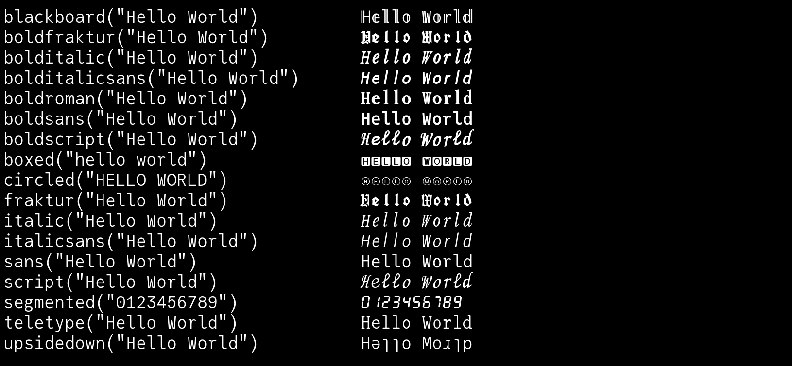
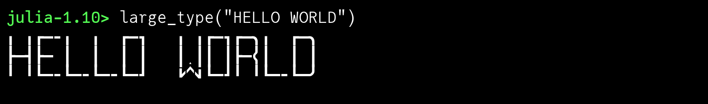
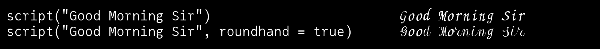

# Zalgo

## Z̝̫͈̝ͩ͒̔͐̑̆̔︠̈a̜̙̜̯͇̳̱ͯͫͦ͑ͦ͘͟l͙͙̻̱͌ͮ̐́ͮͯ͟͢g͚̋̈̎͋̎̒̐ͮͯͦò̻̉\n

Zalgo text is digital text that has been modified by the addition of combining characters, the Unicode symbols more usually employed to position diacritics above and below glyphs.

“Zalgo” was named for a 2004 Internet meme that ascribed it to the influence of an eldritch deity. There’s no official connection with H. P. Lovecraft’s Cthulhu.

Use the `zalgo` function to add diacritics to a string. The options let you control how many diacritics are used. For maximum degeneracy, set `maxmarks` to a large number.

```@example
using Zalgo

zalgo("Julia is cool", maxmarks=100)

```

## Utilities

!!! note

    These utility functions use glyphs from the current font. Not many fonts contain all the necessary glyphs!

Because this package is useless — and occasionally bad, because it can cause some applications to misbehave — it also provides some utility functions to justify its existence.

The following functions convert the input string to equivalent characters that are to be found in the eldritch lexicon of the Unicode realm, where arcane glyphs and cryptic symbols abound.

```julia
blackboard("Hello World")        # double-struck or 'blackboard' style       
boldfraktur("Hello World")       # bold Fraktur (black letter)     
bolditalic("Hello World")        # bold italic      
bolditalicsans("Hello World")    # bold italic sans-serif      
boldroman("Hello World")         # bold roman       
boldsans("Hello World")          # bold sans-serif      
boldscript("Hello World")        # bold script-style      
fraktur("Hello World")           # Fraktur (black letter)     
large_type("Hello World")        # Large Type (9 segments per glyph)
italic("Hello World")            # italic      
italicsans("Hello World")        # italic sans-serif     
sans("Hello World")              # sans-serif      
script("Hello World")            # script      
teletype("Hello World")          # monospaced 'teletype'      
upsidedown("Hello World")        # might look like it's flipped upside down      
circled("HELLO WORLD")           # letters in circles     
boxed("hello world")             # letters in boxes      
segmented("0123456789")          # digits converted to 7-segment 'LED"-type display
```



You can see what's going on using:

```julia-repl
julia-1.10> collect(blackboard("Hello World"))
11-element Vector{Char}:
 'ℍ': Unicode U+210D (category Lu: Letter, uppercase)
 '𝕖': Unicode U+1D556 (category Ll: Letter, lowercase)
 '𝕝': Unicode U+1D55D (category Ll: Letter, lowercase)
 '𝕝': Unicode U+1D55D (category Ll: Letter, lowercase)
 '𝕠': Unicode U+1D560 (category Ll: Letter, lowercase)
 ' ': ASCII/Unicode U+0020 (category Zs: Separator, space)
 '𝕎': Unicode U+1D54E (category Lu: Letter, uppercase)
 '𝕠': Unicode U+1D560 (category Ll: Letter, lowercase)
 '𝕣': Unicode U+1D563 (category Ll: Letter, lowercase)
 '𝕝': Unicode U+1D55D (category Ll: Letter, lowercase)
 '𝕕': Unicode U+1D555 (category Ll: Letter, lowercase)
```

### "Large Type"

Unicode 16 defines a set of glyphs that can be combined in a 3 × 3 grid to build larger letters.



### Script styles

There are two mathematical script styles:


