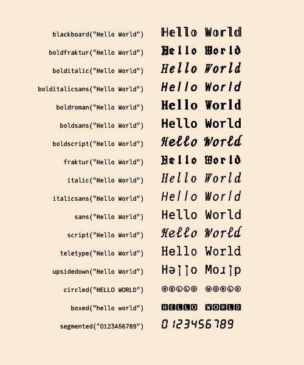

# Zalgo

## z͍͌︡͢aͯͥͫ̂l̥̓g︡͛̽̑͢o̰͛̉︠

Zalgo text is digital text that has been modified by the addition of combining characters, Unicode symbols more usually employed to position diacritics above and below glyphs.

"Zalgo" was named for a 2004 Internet meme that ascribed it to the influence of an eldritch deity. There's no official connection with H. P. Lovecraft's Cthulhu.

Use the `zalgo` function to add diacritics to a string. The options let you control how many diacritics are used. For maximum degeneracy, set `maxmarks` to a large number.

```@example
using Zalgo

zalgo("Julia is cool", maxmarks=100)

```

Results vary considerably from font to font.

## Utilities

Because this package is useless - and occasionally bad, because it can cause some applicatipns to misbehave (it can crash Atom, for example) - it also provides some conversions to justify its existence.

The following functions convert the input string to equivalent characters that are to be found in the darkest recesses of the Unicode charts.



Of course, not all these characters will be available in the current font.
